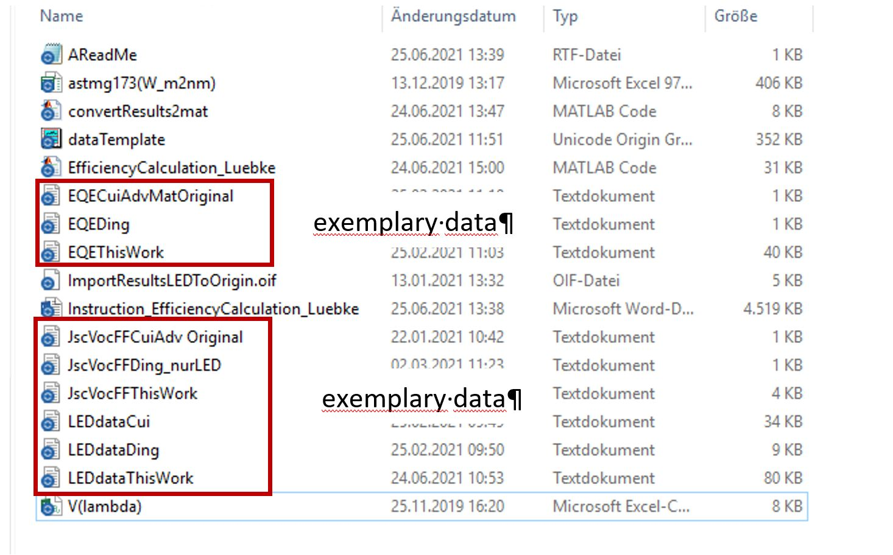
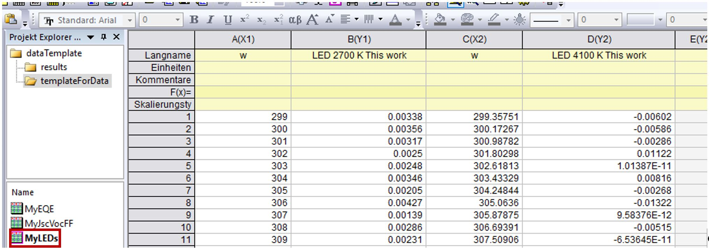
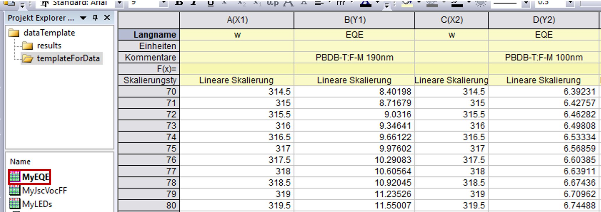
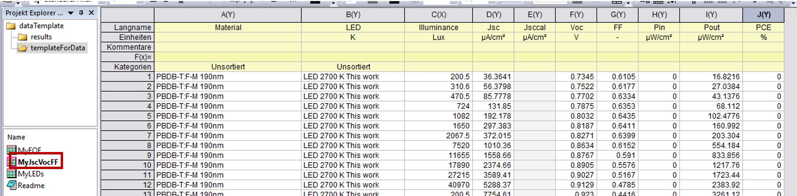
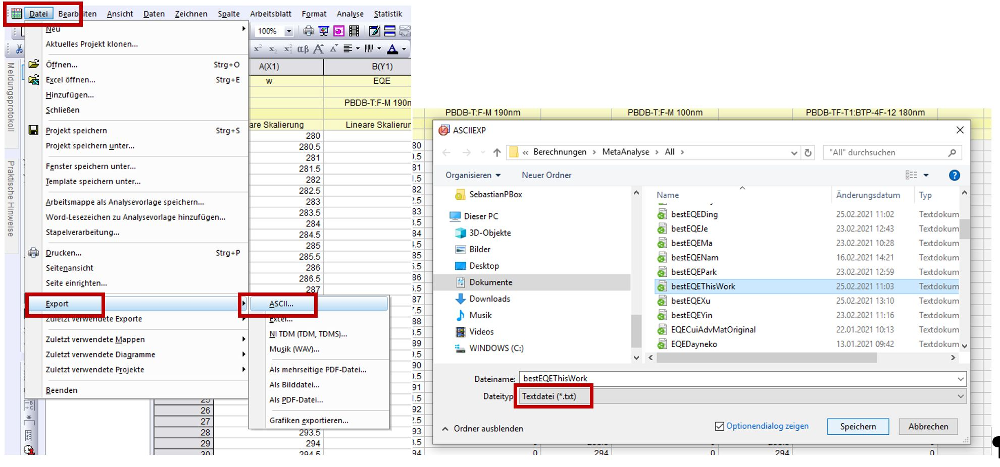
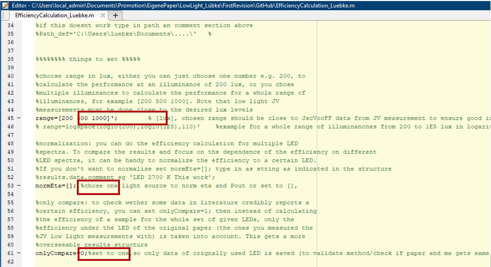

# Determine_Indoor_PV_Performance
The purpose of this file is to calculate the efficiency of a solar cell under a given illuminance (i.e. 200 lux) for an arbitrary light source spectrum (i.e. a certain LED). The point is to be able to compare efficiencies at different illuminances or at the same illuminance but with different light sources of e.g. different color temperature. The script needs the spectra of the light sources at least in arbitrary units (not in absolute ones) and the external quantum efficiency of the solar cell as well as fill factor and open-circuit voltage data at roughly the right illuminances. The rest is calculated. The advantage of the approach is that the script does not need an actually measured JV curve of a cell under a specific illumination but it calculates what the short-circuit current and the efficiency should be based on the external quantum efficiency.

In the following, you can find instructions on how to use the script.

Instruction for calculation of the efficiency with different light sources and illumination levels
Files you need 

For using the code, you need three types of data, please open the dataTemplate.opju Origin file to make sure your own input data has the right structure to be used by the Matlab script

# Getting your data

Spectral irradiance data of the light source should look like this, the name of the LED will be taken to Matlab, wavelengths are in [nm] and the spectral irradiance in [W/m²/nm].

Your EQE measurements should look like this, wavelengths in [nm], EQE in [%], note that the name of the sample in the comments will be imported to Matlab and should be the same as in the JV (JscVocFF) measurements to ensure the Matlab code will find the right EQE to the JV measurements

JV measurements for Voc(Jsc) and FF(Jsc) pairs measured with one arbitrary light source should look like this. The names of samples in col(a) should be exactly the same as in the EQE table and the names of the LED in col(b) should be the same as in the LED table. For the calculation only Jsc Voc and FF are needed, but in case you take data from literature you can also type in Jsc,cal, illuminances, output powers, input powers and the PCEs given in literature. So you can compare these values later on with the calculated ones.

Save all data as txt files as described in the following, so you are ready to used the Matlab script

# MATLAB
Open Matlab and specify range, normEta and onlyCompare as described in the comments. The variable range defines the illuminance levels for which you want to calculate the efficiencies, make sure that range is a one column vector range=[200 500 100]’;

Now you are ready to go, run the script:
Select LED data, you can choose one or multiple files; a single file can also contain more LEDs in multiple columns as described above; select EQE data; select JV data

