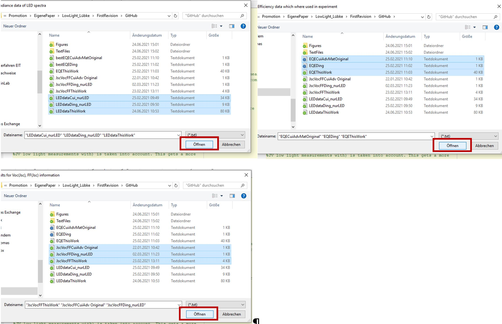

# Determine_Indoor_PV_Performance
The purpose of this file is to calculate the efficiency of a solar cell under a given illuminance (i.e. 200 lux) for an arbitrary light source spectrum (i.e. a certain LED). The point is to be able to compare efficiencies at different illuminances or at the same illuminance but with different light sources of e.g. different color temperature. The script needs the spectra of the light sources at least in arbitrary units (not in absolute ones) and the external quantum efficiency of the solar cell as well as fill factor and open-circuit voltage data at roughly the right illuminances. The rest is calculated. The advantage of the approach is that the script does not need an actually measured JV curve of a cell under a specific illumination but it calculates what the short-circuit current and the efficiency should be based on the external quantum efficiency.

In the following, you can find instructions on how to use the script.

Instruction for calculation of the efficiency with different light sources and illumination levels
Files you need 

For using the code, you need three types of data, please open the dataTemplate.opju Origin file to make sure your own input data has the right structure to be used by the Matlab script

# Getting your data

Spectral irradiance data of the light source should look like this, the name of the LED will be taken to Matlab, wavelengths are in [nm] and the spectral irradiance in [W/m²/nm].

Your EQE measurements should look like this, wavelengths in [nm], EQE in [%], note that the name of the sample in the comments will be imported to Matlab and should be the same as in the JV (JscVocFF) measurements to ensure the Matlab code will find the right EQE to the JV measurements

JV measurements for Voc(Jsc) and FF(Jsc) pairs measured with one arbitrary light source should look like this. The names of samples in col(a) should be exactly the same as in the EQE table and the names of the LED in col(b) should be the same as in the LED table. For the calculation only Jsc Voc and FF are needed, but in case you take data from literature you can also type in Jsc,cal, illuminances, output powers, input powers and the PCEs given in literature. So you can compare these values later on with the calculated ones.

Save all data as txt files as described in the following, so you are ready to used the Matlab script

# MATLAB
Open Matlab and specify range, normEta and onlyCompare as described in the comments. The variable range defines the illuminance levels for which you want to calculate the efficiencies, make sure that range is a one column vector range=[200 500 100]’;

Now you are ready to go, run the script:
Select LED data, you can choose one or multiple files; a single file can also contain more LEDs in multiple columns as described above; select EQE data; select JV data

All LED data and EQE data is read in and interpolation to one common wavelength axis w is done. All generated figures are saved in a new folder …/Path/Figures.

You should check if the interpolation is done right with these figures. Also check if the infections points for the EQE measurements are right. 

For every sample the EQE is shown with LED data.

The Voc(Jsc) and FF(Jsc) data from the JV measurements are shown as well. 

# Where do I find the results, what are the variables? 

It is a nice way organize data with structures in Matlab if a lot of data is produced. If you are not familiar with structures, you can see how to find the results in the following:

All important data is saved in the structures dataQE, dataLED, dataJVLED, and results. Double click on the structure in the workspace to see the data inside.

# dataLED

Here you find everything about the light sources for which the calculation was done. The wavelength w [nm] and the spectral irradiance spIrra [W/m²/nm] are the original data, spIrra_int [W/m²/nm] and spIllu_int [lux/nm] (Equation 2 of the main paper) are the interpolated spectral irradiance and the interpolated spectral illuminance (to the common wavelength vector w). Pin_Ref [W/m²] and Illu_Ref [lux] are the input power and the illuminance obtained by integration of the reference spectral data. Illu_f [lux] are the chosen illuminances for which the calculation is done, you specified these in range. All variables ending with *_f* imply that they refer to the chosen illuminances. f [ ] is the factor which scales the spectra to the desired illuminances (Equation 4 in the main paper). Pin [µW/cm²] is the input power at the desired illuminances (Equation 5 of the main paper). 

# dataQE

The wavelength w [nm] and the QE [ ] are the original data, QE_int2 [ ] is the interpolated QE (to the common wavelength vector w) and QE_AM [ ] is the interpolated QE to the wavelength vector of the AM1.5 spectrum. winfl [nm] is the inflection point of QE(w), which is the wavelength of the band gap and idxinfl is the index of the inflection point referring to the common wavelength vector w. JscAM [mA/cm²] is the Jsc calculated under AM1.5 spectrum.

# dataJVLED

Here the data of low light JV measurements can be found, it has just the same appearance as you put the data in the dataTemplate origin file. Note again, that only Jsc, Voc and FF are used for the calculation, all other parameters are just for comparison, in case the data is known from literature or from own JV measurements. Units can be found above.

# results

The results structure contains some repetitive data (which is partly just a copy from the other structures), but it is handy to have all data in one structure. In the picture above, you can see the ‘first level’ of the results structure. You can find the sample name and the LED (for which the original low light JV was measured). The data field can be opened by double clicking and is explained below. idxQE is the index of the QE measurement refering to the dataQE structure. Jsc Voc and FF are the same values as in the dataJVLED structure and are just showed here for a complete picture of data.

# Results.data

This is what you see when you double click on data in the results structure. All data is from one sample and the different fields (rows) show the results from the different LEDs. The columns until Illu_f show the LED data, which is a copy from dataLED. After that all performance parameters Jsc_f [µA/cm²], Voc_f [V], FF_f [%], Pout_f [µW/cm²], and eta_f [%] are shown under the different illuminations and LEDs (rows). If you choose 3 illuminances you will get vectors with three entries, each for one illuminance. The integratedJsc_f is the wavelength dependent cumulative Jsc for the specific LED at the different illuminances. Pout_norm and eta_norm are the output powers and efficiencies normalized to the LED specified in normEta.

The results are now shown in the following two plots:
1) Illumination dependent data of each sample

2) performance dependent on the spectrum of the light source at one lux level

In the end you can use the function ConvertResults2Mat to save textfiles in the folder ….Path/Textfiles/. For this see instructions in the code (the Matlab function writecell is needed which is standard from Matlab version 2019a). After creating the text files, they an be loaded into origin again to do nice plots. 

